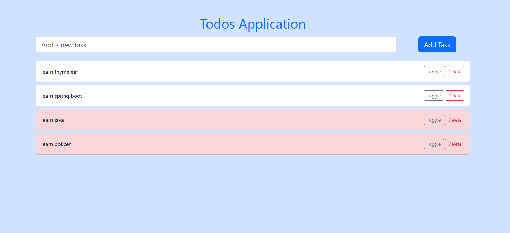

# Gestion de Task avec Spring Boot, Thymeleaf, PostgreSQL et Bootstrap

## Description
Ce projet est une application de gestion de tâches développée avec Spring Boot pour le backend, Thymeleaf pour le frontend, PostgreSQL comme base de données et Bootstrap pour le design.

## Prérequis
- Java 23 ou supérieur
- Maven
- PostgreSQL

## Installation

1. Clonez le dépôt :
   ```bash
   git clone https://github.com/tky0065/gestion-de-task.git
   cd gestion-de-task
   ```

2. Configurez la base de données PostgreSQL :
    - Créez une base de données nommée `task_management`.
    - Mettez à jour les informations de connexion dans le fichier `src/main/resources/application.properties` :
      ```properties
      spring.datasource.url=jdbc:postgresql://localhost:5432/task_management
      spring.datasource.username=your_username
      spring.datasource.password=your_password
      ```

3. Compilez et exécutez l'application :
   ```bash
   mvn clean install
   mvn spring-boot:run
   ```

## Utilisation
Accédez à l'application via `http://localhost:8080`.

## Fonctionnalités
- Ajouter, modifier et supprimer des tâches
- Marquer les tâches comme terminées
- Filtrer les tâches par statut

## Technologies utilisées
- Spring Boot
- Thymeleaf
- PostgreSQL
- Bootstrap

## Structure du projet
```
gestion-de-task/
├── src/
│   ├── main/
│   │   ├── java/
│   │   │   └── com/
│   │   │       └── example/
│   │   │           └── taskmanagement/
│   │   │               ├── controller/
│   │   │               ├── model/
│   │   │               ├── repository/
│   │   │               └── service/
│   │   ├── resources/
│   │   │   ├── templates/
│   │   │   └── application.properties
│   └── test/
├── pom.xml
└── README.md
```

## Capture d'écran


## Auteur
- Enokdev

## Licence
Ce projet est sous licence MIT.